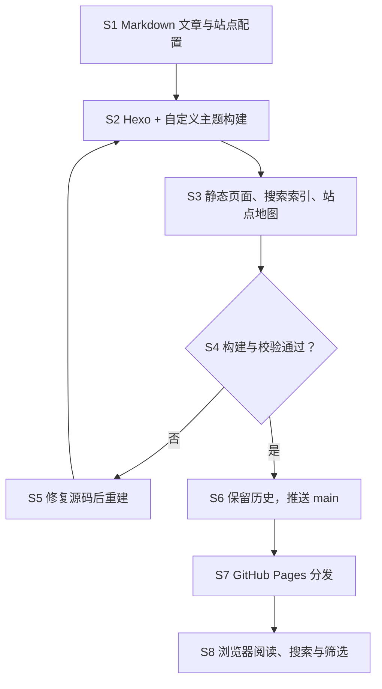

# 网站运行流程（当前实现，已验证）

```mermaid
flowchart TD
  S1["S1 Markdown 文章与站点配置"] --> S2["S2 Hexo + 自定义主题构建"]
  S2 --> S3["S3 静态页面、搜索索引、站点地图"]
  S3 --> S4{"S4 构建与校验通过？"}
  S4 -->|否| S5["S5 修复源码后重建"]
  S5 --> S2
  S4 -->|是| S6["S6 保留历史，推送 main"]
  S6 --> S7["S7 GitHub Pages 分发"]
  S7 --> S8["S8 浏览器阅读、搜索与筛选"]
```

源码 source 分支保留可迁移工程，main 只承载生成产物。搜索由浏览器读取静态 JSON，不需要后端。

关联：[开发计划](项目-开发计划图.md)、[部署与迁移](部署-GitHub-Pages.md)。
